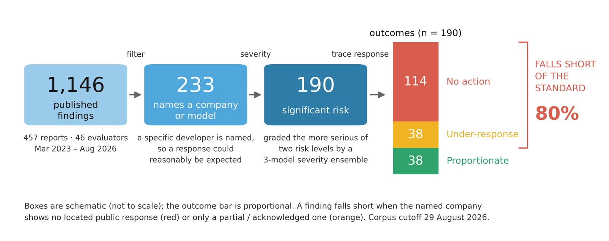

# Do third-party frontier AI evaluations matter?

**Live site → https://kunalsingh9373.github.io/evaluating-the-evaluators/**



Government AI institutes and independent evaluators test advanced systems for dangerous
capabilities, safeguard failures and other risks — often with access and technical expertise
unavailable to the wider public. Yet identifying a risk is not the same as reducing it. An
evaluation can document a serious vulnerability without compelling a developer response, delaying
deployment, triggering additional review, or verifying remediation.

This project asks one narrow question: **when an evaluator publishes a risk-relevant finding about
a named frontier system, does the public record document action attributed to that finding and
directed at mitigating the identified risk?**

## Scope

A source-verified census of **1,146 findings** from **457 reports** by **46 evaluating
institutions**, March 2023 – August 2026. Every cell is verified-real or deliberately empty; a
company action counts only if it is causally attributable to the finding and sourced from the
company's own primary document. Severity is coded by a three-model cross-provider ensemble with
two-author human review.

Of the **190** significant-risk findings that name a company:

| | |
|---|---|
| no documented public response at all | **114 — 60.0%** |
| response fell short of what the severity warranted | **152 — 80.0%** |

The bar is severity-relative: a significant-risk finding needs a substantive response, a lesser one
only a partial. The measure scores the *content* of the public response — not whether it was
implemented, nor whether it reduced risk.

## What is in this repo

The repo is the **website at the root** and the **complete research artifact under `research/`**.

| Path | Contents |
|---|---|
| `index.html`, `app.js`, `data.js`, `dataset.csv` | The dashboard. Static — no build step, no dependencies. `data.js` and `dataset.csv` are generated; never edit them by hand |
| `build_data.py` | Regenerates `data.js` and `dataset.csv` from the workbook |
| `charts/` | Web-sized JPGs of every figure, as shown in the site gallery |
| `research/dataset/` | **`AISIEVAL_V13.xlsx` — the source of truth**, plus `AISIEVAL_validate.py`, the integrity validator (currently PASS, 0 violations) |
| `research/rulebook/` | `v11_RULEBOOK.md` — the normative coding rules: scope gate, finding eligibility, one-company-per-row, severity, the evidentiary standard |
| `research/protocol/` | Search, screening and response-search protocols, and the codebooks |
| `research/scripts/` | Everything that reads the workbook: chart generators, statistics, validators, the merge and repair tools |
| `research/charts/` | The 29 full-resolution figures |
| `research/severity/` | The frozen severity prompt, the ensemble runner, and the raw per-finding votes |
| `research/sweep/` | The discovery census: enumeration ledger and per-evaluator screening slices |
| `research/paper/` | `DRAFT_6.2.md`, the LaTeX source under `latex/`, and the submission bundles |
| `research/archive/`, `research/working/` | Superseded workbooks and intermediate files, kept for provenance |
| `research/deck/` | A 10-minute presentation of the project |

## Using it

**Read the data** — open `dataset.csv`, or `research/dataset/AISIEVAL_V13.xlsx` for the workbook
with all columns. `research/rulebook/v11_RULEBOOK.md` defines every column and every rule.

**Reproduce the numbers** — `pip install -r research/requirements.txt`, then from
`research/scripts/`:

```
python3 all_stats.py          # every headline figure, recomputed from the workbook
python3 ../dataset/AISIEVAL_validate.py   # integrity checks
bash   build_charts.sh        # regenerates all 29 figures
python3 verify_charts.py      # asserts every figure agrees with the workbook
```

Nothing is hand-entered: every number in the paper, the site and the figures is derived from the
workbook by one of these scripts, and `verify_charts.py` fails if any of them drifts.

**Update the data** — edit the workbook, run `build_data.py`, commit. The scripts reach the
workbook only through `research/scripts/dataset_source.py`; set `AISIEVAL_WORKBOOK` to point
elsewhere.

Built by [Kunal Singh](https://kunalsingh9373.github.io).
